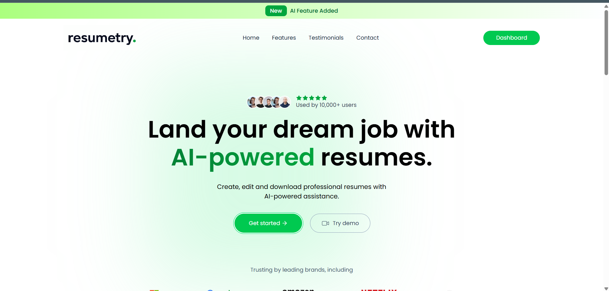
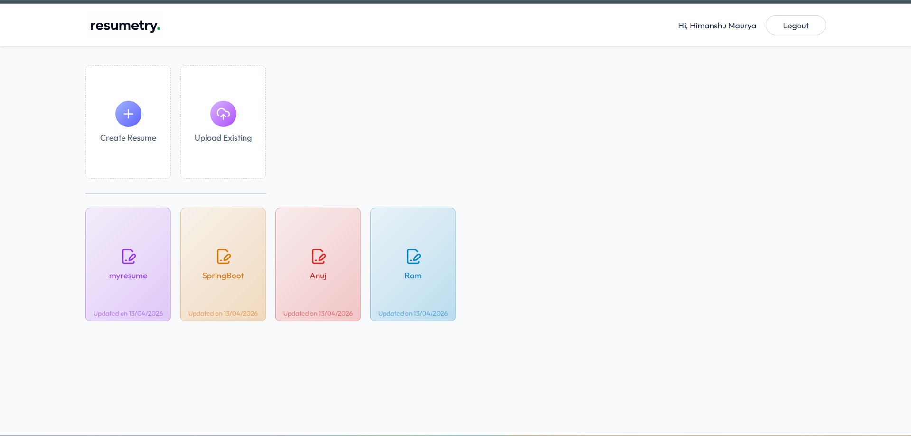

# 🚀 Resumetry

Resumetry is an AI-powered resume builder that helps users create professional, ATS-friendly resumes instantly. It leverages modern web technologies along with AI to generate high-quality resume content effortlessly.

---

## 📌 What is Resumetry?

Resumetry allows you to:

- 🧠 Generate AI-powered resume summaries using Gemini API  
- 📄 Create, manage and share resumes 
- 🖼️ Upload and optimize profile images with ImageKit  
- 🔐 Secure authentication system (JWT)  
- ⚡ Build resumes quickly with a clean UI  

---

## 🖼️ Preview

<p align="center">
  
  &nbsp;&nbsp;&nbsp;
  
</p>

 

## 🛠 Technology Stack

| Layer      | Technology |
|------------|-----------|
| Frontend   | React (Vite) + Tailwind CSS |
| Backend    | Node.js + Express.js |
| Database   | MongoDB |
| AI         | Google Gemini API |
| Media      | ImageKit |
 

---

## 💡 Key Features

- 🤖 **AI Resume Generation** – Smart summaries using Gemini  
- 🖼️ **Image Upload** – Optimized via ImageKit CDN  
- 🔐 **Authentication** – Secure login system  
- 📱 **Responsive UI** – Works on all devices  
- ⚡ **Fast & Scalable** – Optimized full-stack architecture  

---

## ⚙️ Local Development Setup

### 🖥 Backend Setup

```bash
# Clone the repository
git clone https://github.com/your-username/resumetry.git
cd server

# Install dependencies
npm install

# Run server
npm start server
```
**Environment Variables (.env): **
```properties
MONGODB_URI=your_mongodb_uri
JWT_SECRET=your_secret_key
GEMINI_API_KEY=your_gemini_api_key
IMAGEKIT_PRIVATE_KEY=your_imagekit_private_key 
GEMINI_BASE_URL= "https://generativelanguage.googleapis.com/v1beta/openai/"
GEMINI_MODEL="gemini-2.5-flash"
```
### 💻 Frontend Setup
```bash
cd client
npm install
npm run dev
```
Your frontend will run at: http://localhost:5173
